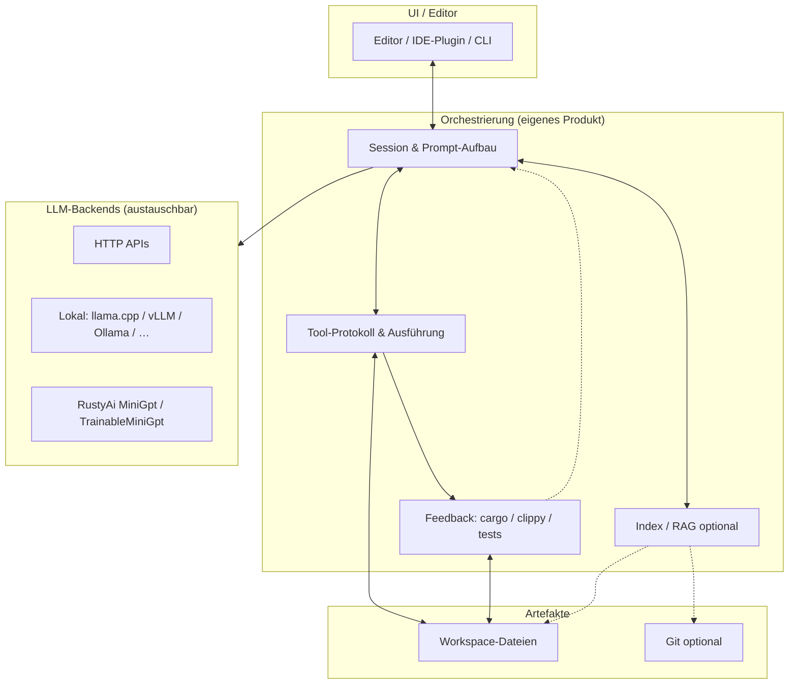

# Architektur und Roadmap — Pfad B (IDE-nah, produktionsnahe Qualität)

Dieses Dokument beschreibt eine **Zielarchitektur** und **Roadmap** für ein System zur **Code-Analyse, -Generierung, -Migration, Bugsuche und -Behebung**, das **nicht** nur aus dem RustyAi-Workspace besteht, sondern RustyAi als **optionalen Baustein** in einer größeren Anwendung einordnet.

**Pfad B** bedeutet: Fokus auf **Orchestrierung**, **Tool-Loops**, **Feedback von Compiler/Tests** und **starke Basismodelle** (lokal oder API) — nicht darauf, ein State-of-the-Art-LLM ausschließlich im RustyAi-Kern nachzubauen.

Verwandte interne Referenzen: [HANDBUCH.md](HANDBUCH.md) (RustyAi-Workspace), [README.md](README.md) (Übersicht), [README im Projektroot](../README.md).

---

## 1. Leitprinzipien

| Prinzip | Konsequenz |
| ------- | ------------ |
| **Trennung Modell / Orchestrator** | Das „Gehirn“ für komplexe Aufgaben ist ein **konfigurierbares LLM-Backend** (HTTP-API, lokaler Server, später ggf. eingebettete Inferenz). RustyAi bleibt **Lehr-, Test- und Offline-Fallback**. |
| **Tools vor reinem Chat** | Dateien lesen/schreiben, diffbasierte Änderungen, **Sandbox-Commands** (`cargo check`, Tests) sind **First-Class** — nicht nachträglich „Prompt-Engineering only“. |
| **Kurze Feedback-Schleifen** | Nach Änderungen: **statische Diagnose + Tests** zurück ins System (Modell oder Heuristik). Das reduziert Halluzinationen bei Migration und Bugfixes. |
| **Kontext sparsam** | **Indexing** (Chunks, Pfade, Symbole) statt vollständiges Repo im Prompt; LSP-/AST-Infos wo verfügbar. |
| **Sicherheit und Nachvollziehbarkeit** | Keine uneingeschränkten Shell-Befehle; **Policy** pro Umgebung (lokal vs. CI); nachvollziehbare **Schritte** (Logs, optional Replay). |

---

## 2. Zielarchitektur (logische Schichten)

### 2.1 Kontextdiagramm

### 2.2 Verantwortlichkeiten

| Schicht | Aufgaben | Technologie (Richtung) |
| ------- | -------- | ---------------------- |
| **UI** | Eingabe, Diff-Vorschau, Genehmigung von Tool-Schritten, Logs | Editor-Plugin, TUI oder Web; nicht Teil von RustyAi-Core |
| **Orchestrierung** | Chat-/Agent-Schleife, Kontext zusammenstellen, Tool-JSON parsen, Reihenfolge und Limits | Eigenes Crate oder Binary in **separate Repo/Workspace** neben RustyAi möglich |
| **Tool-Schicht** | `read_file`, `write_file` / Patch, `run_cmd` (allowlist), ggf. `workspace_symbols` | Stabil definiertes JSON-Schema; Ausführung sandboxed |
| **Feedback** | `cargo check`, `cargo test`, optional `clippy`; Ausgabe strukturiert an Orchestrator | `std::process` + Parser; keine Abhängigkeit von RustyAi |
| **Index / RAG** | Chunking, Embeddings, Retrieval vor dem LLM-Aufruf | Embedding-API oder lokales Modell; Vektorstore optional |
| **RustyAi** | Kleines LM, Determinismus, Experimente, Schulungsbeispiele | Vorhandener Workspace (`rusty_ai_llm`, …) |

### 2.3 Datenfluss (typischer Bugfix / Migration)

1. Nutzer beschreibt Ziel; Orchestrator lädt **relevante Chunks** (Index + ggf. explizite Pfade).
2. **LLM** erhält System-Prompt (Tools, Regeln) + Kontext + Nutzeranfrage.
3. Modell antwortet mit **Tool-Aufrufen** oder Text; Orchestrator führt Tools aus.
4. Nach Schreibzugriff: **Feedback** (`cargo check` / Tests).
5. Bei Fehler: kompakte **Diagnose** erneut an LLM oder gesteuerte Wiederholung mit Limit (**Max-Turns**).

RustyAi kann Schritt 2 nur dann allein übernehmen, wenn Modellgröße und Kontext ausreichen — für Pfad B ist ein **externes Backend** die Regel.

---

## 3. Einordnung RustyAi

| Rolle | Nutzen für B |
| ----- | -------------- |
| **Bibliothek** | Vorhandene Pipelines: `generate`, `TrainableMiniGpt`, Checkpoints, optional GPT-2-BPE — für **Experimente** und **Regressionstests** der eigenen Orchestrierung. |
| **Nicht** | Vollständiger Ersatz für große Code-LLMs oder GPU-Trainingsfarmen. |
| **Optional** | Candle-Backend für ausgewählte Ops; kein Ersatz für ein durchdesigntes Produkt-Backend. |

Empfehlung: Im **Produkt-Repository** ein Trait ähnlich `LlmBackend: Send` mit `complete` / `stream` implementieren; eine Implementierung kann intern RustyAi nutzen (kleines Modell), andere leiten an HTTP weiter.

---

## 4. Roadmap (phasenweise)

Die Phasen sind **priorisiert** für einen schrittweise wachsenden Nutzen; konkrete Zeitrahmen bewusst offen (Teamgröße und Scope variieren).

### Phase 0 — Fundament

- [x] **Abstraktion `LlmBackend`** — Trait, `CompletionRequest` / `CompletionResponse`, `LlmError` im Workspace-Crate **`rusty_ai_agent`** (sync; async später im Anwendungscode). Quelle: [`rusty_ai_agent/src/llm_backend.rs`](../rusty_ai_agent/src/llm_backend.rs).
- [x] **Minimales Tool-Protokoll** — `ToolInvocation` (`read_file`, `write_file`, `run_cmd`), Parsing aus `ModelToolCall`, JSON Schema: [`rusty_ai_agent/schemas/tool_invocation.json`](../rusty_ai_agent/schemas/tool_invocation.json). Quelle: [`rusty_ai_agent/src/tools.rs`](../rusty_ai_agent/src/tools.rs).
- [ ] **Ein** End-to-End-Flow: Anfrage → Modell → Patch oder Dateiänderung → `cargo check` → Ergebnis in der UI/CLI (Orchestrierungs-Binary oder separates Produkt-Repo; nicht Teil von `rusty_ai_agent`).
- [ ] Dokumentation der **Sicherheitsregeln** (Pfad-Allowlist, kein `rm -rf` ohne explizite Policy) — Kurzüberblick im [`rusty_ai_agent/README.md`](../rusty_ai_agent/README.md); verbindliche Policy im Produkt.

**Erfolgskriterium:** Reproduzierbarer Demo-Workspace, in dem eine kleine Änderung mit Compiler-Feedback funktioniert.

**Hinweis:** `rusty_ai_agent` liefert nur **Typen und Kontrakte**; HTTP-Client, Dateizugriff und Subprocess bleiben im **Executor** eurer Anwendung.

### Phase 1 — Produktreife (MVP IDE-nah)

- [ ] **Streaming** der Modellantwort (wo das Backend es hergibt).
- [ ] **Stop-Sequenzen**, **max_tokens**, robustes Parsing von Tool-JSON (Retry / Reparatur-Prompt bei Parsefehler).
- [ ] **Diff-Ansicht** oder SEARCH/REPLACE-Blöcke statt blindem Volltext-Overwrite.
- [ ] **Zwei Backends** parallel: z. B. OpenAI-kompatible API + lokaler Server.
- [ ] Telemetrie optional (lokal only): Latenz, Anzahl Turns, Erfolg von `cargo check`.

**Erfolgskriterium:** Migration einer kleinen, gut abgegrenzten Refactoring-Aufgabe (eine Crate, wenige Dateien) mit messbar weniger manuellen Korrekturen als „reiner Chat ohne Tools“.

### Phase 2 — Kontext und Qualität

- [ ] **Workspace-Index:** Chunking nach Datei/Symbol, einfache Suche; optional **Embeddings**.
- [ ] Integration **LSP-Diagnosen** (wo vorhanden) zusätzlich zu `cargo check`.
- [ ] **Testauswahl:** gezielt `cargo test -p …` oder Filter, um Feedback schnell zu halten.
- [ ] Vorlagen für **System-Prompts** (Analyse vs. Migration vs. Fix) versionieren.

**Erfolgskriterium:** Größere Repos werden ohne „alles in den Prompt“ bedienbar; wiederholbare Qualität über Sessions.

### Phase 3 — Skalierung und Betrieb

- [ ] **Policies** pro Umgebung (Dev / CI): unterschiedliche Tool-Allowlists.
- [ ] **Batch-/CI-Modus:** Aufgaben ohne interaktive UI (z. B. Nightly-Migrations-Vorschläge mit Report).
- [ ] Optional: **Caching** von Index und Embedding; **Kosten-Limits** bei API-Backends.

**Erfolgskriterium:** Betreibbarkeit im Team (mehrere Nutzer/Repo-Klon) ohne Sicherheits- und Kosten-Chaos.

### Phase 4 — Vertiefung KI (optional)

- [ ] Feintuning oder **DPO/Preference** außerhalb von RustyAi (typisch Python/HF); RustyAi nur, wenn bewusst kleines Modell trainiert werden soll.
- [ ] **RustyAi-spezifisch:** gezielte Erweiterungen (längere Kontexte, Streaming in `rusty_ai_llm`, …) nur wenn Offline-Fallback strategisch wichtig wird — siehe TODO/FIXME in den Crates.

---

## 5. Risiken und bewusste Nicht-Ziele

| Risiko | Mitigation |
| ------ | ---------- |
| Modell halluziniert trotz Tools | Strikte Tool-Validierung, Compiler-Feedback, max. Turns, menschliche Freigabe für große Diffs |
| Kontext zu groß / zu teuer | Index, Zusammenfassungen, kleinere Chunks |
| Sicherheit bei `run_cmd` | Allowlist, Timeout, Arbeitsverzeichnis fixieren |

**Nicht-Ziel von Pfad B:** RustyAi-Workspace allein zu einem vollwertigen Konkurrenten zu kommerziellen Code-LLMs umbauen; stattdessen **klare Schnittstellen** und **Orchestrierung** priorisieren.

---

## 6. Pflege dieses Dokuments

Bei Architekturentscheidungen (nur Rust vs. Rust+Orchestrator-Service, async-Laufzeit, konkrete API-Anbieter) **dieses Kapitel** oder ein Architektur-ADR ergänzen. Änderungen am RustyAi-Workspace (neue Crates, Features) weiterhin im [HANDBUCH.md](HANDBUCH.md) und Root-[README](../README.md) festhalten.
