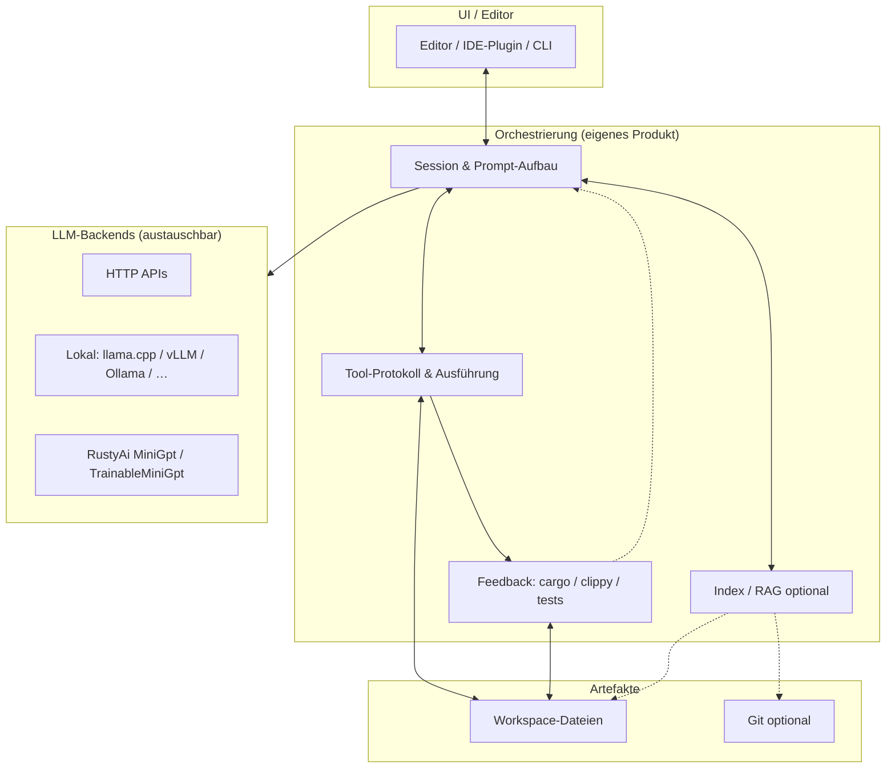

# Architektur und Roadmap — Pfad B (IDE-nah, produktionsnahe Qualität)

Dieses Dokument beschreibt eine **Zielarchitektur** und **Roadmap** für ein System zur **Code-Analyse, -Generierung, -Migration, Bugsuche und -Behebung**, das **nicht** nur aus dem RustyAi-Workspace besteht, sondern RustyAi als **optionalen Baustein** in einer größeren Anwendung einordnet.

**Pfad B** bedeutet: Fokus auf **Orchestrierung**, **Tool-Loops**, **Feedback von Compiler/Tests** und **starke Basismodelle** (lokal oder API) — nicht darauf, ein State-of-the-Art-LLM ausschließlich im RustyAi-Kern nachzubauen.

Verwandte interne Referenzen: [HANDBUCH.md](HANDBUCH.md) (RustyAi-Workspace), [README.md](README.md) (Übersicht), [README im Projektroot](../README.md).

---

## 1. Leitprinzipien

| Prinzip | Konsequenz |
| ------- | ------------ |
| **Trennung Modell / Orchestrator** | Das „Gehirn“ für komplexe Aufgaben ist ein **konfigurierbares LLM-Backend** (HTTP-API, lokaler Server, später ggf. eingebettete Inferenz). RustyAi bleibt **Lehr-, Test- und Offline-Fallback**. |
| **Tools vor reinem Chat** | Dateien lesen/schreiben, diffbasierte Änderungen, **Sandbox-Commands** (`cargo check`, Tests) sind **First-Class** — nicht nachträglich „Prompt-Engineering only“. |
| **Kurze Feedback-Schleifen** | Nach Änderungen: **statische Diagnose + Tests** zurück ins System (Modell oder Heuristik). Das reduziert Halluzinationen bei Migration und Bugfixes. |
| **Kontext sparsam** | **Indexing** (Chunks, Pfade, Symbole) statt vollständiges Repo im Prompt; LSP-/AST-Infos wo verfügbar. |
| **Sicherheit und Nachvollziehbarkeit** | Keine uneingeschränkten Shell-Befehle; **Policy** pro Umgebung (lokal vs. CI); nachvollziehbare **Schritte** (Logs, optional Replay). |

---

## 2. Zielarchitektur (logische Schichten)

### 2.1 Kontextdiagramm

### 2.2 Verantwortlichkeiten

| Schicht | Aufgaben | Technologie (Richtung) |
| ------- | -------- | ---------------------- |
| **UI** | Eingabe, Diff-Vorschau, Genehmigung von Tool-Schritten, Logs | Editor-Plugin, TUI oder Web; nicht Teil von RustyAi-Core |
| **Orchestrierung** | Chat-/Agent-Schleife, Kontext zusammenstellen, Tool-JSON parsen, Reihenfolge und Limits | Eigenes Crate oder Binary in **separate Repo/Workspace** neben RustyAi möglich |
| **Tool-Schicht** | `read_file`, `write_file` / Patch, `run_cmd` (allowlist), ggf. `workspace_symbols` | Stabil definiertes JSON-Schema; Ausführung sandboxed |
| **Feedback** | `cargo check`, `cargo test`, optional `clippy`; Ausgabe strukturiert an Orchestrator | `std::process` + Parser; keine Abhängigkeit von RustyAi |
| **Index / RAG** | Chunking, Embeddings, Retrieval vor dem LLM-Aufruf | Embedding-API oder lokales Modell; Vektorstore optional |
| **RustyAi** | Kleines LM, Determinismus, Experimente, Schulungsbeispiele | Vorhandener Workspace (`rusty_ai_llm`, …) |

### 2.3 Datenfluss (typischer Bugfix / Migration)

1. Nutzer beschreibt Ziel; Orchestrator lädt **relevante Chunks** (Index + ggf. explizite Pfade).
2. **LLM** erhält System-Prompt (Tools, Regeln) + Kontext + Nutzeranfrage.
3. Modell antwortet mit **Tool-Aufrufen** oder Text; Orchestrator führt Tools aus.
4. Nach Schreibzugriff: **Feedback** (`cargo check` / Tests).
5. Bei Fehler: kompakte **Diagnose** erneut an LLM oder gesteuerte Wiederholung mit Limit (**Max-Turns**).

RustyAi kann Schritt 2 nur dann allein übernehmen, wenn Modellgröße und Kontext ausreichen — für Pfad B ist ein **externes Backend** die Regel.

---

## 3. Einordnung RustyAi

| Rolle | Nutzen für B |
| ----- | -------------- |
| **Bibliothek** | Vorhandene Pipelines: `generate`, `TrainableMiniGpt`, Checkpoints, optional GPT-2-BPE — für **Experimente** und **Regressionstests** der eigenen Orchestrierung. |
| **Nicht** | Vollständiger Ersatz für große Code-LLMs oder GPU-Trainingsfarmen. |
| **Optional** | Candle-Backend für ausgewählte Ops; kein Ersatz für ein durchdesigntes Produkt-Backend. |

Empfehlung: Im **Produkt-Repository** ein Trait ähnlich `LlmBackend: Send` mit `complete` / `stream` implementieren; eine Implementierung kann intern RustyAi nutzen (kleines Modell), andere leiten an HTTP weiter.

---

## 4. Roadmap (phasenweise)

Die Phasen sind **priorisiert** für einen schrittweise wachsenden Nutzen; konkrete Zeitrahmen bewusst offen (Teamgröße und Scope variieren).

### Phase 0 — Fundament

- [x] **Abstraktion `LlmBackend`** — Trait, `CompletionRequest` / `CompletionResponse`, `LlmError` im Workspace-Crate **`rusty_ai_agent`** (sync; async später im Anwendungscode). Quelle: [`rusty_ai_agent/src/core/llm_backend.rs`](../rusty_ai_agent/src/core/llm_backend.rs).
- [x] **Minimales Tool-Protokoll** — `ToolInvocation` (`read_file`, `write_file`, `run_cmd`), Parsing aus `ModelToolCall`, JSON Schema: [`rusty_ai_agent/schemas/tool_invocation.json`](../rusty_ai_agent/schemas/tool_invocation.json). Quelle: [`rusty_ai_agent/src/tools/invocation.rs`](../rusty_ai_agent/src/tools/invocation.rs).
- [x] **Referenz-Flow:** `cargo run -p rusty_ai_agent --example agent_demo` (Dry-Run) bzw. `--features real-exec -- --real` (echtes Lesen einer Datei + `cargo check` unter [`AllowlistPolicy`](../rusty_ai_agent/src/policy/allowlist.rs)).
- [x] Dokumentation der **Sicherheitsregeln** — [`rusty_ai_agent/README.md`](../rusty_ai_agent/README.md) (Kurz), [`rusty_ai_agent/SECURITY.md`](../rusty_ai_agent/SECURITY.md) (Detail); verbindliche Policy bleibt im Produkt.

**Erfolgskriterium:** Reproduzierbarer Demo-Workspace, in dem eine kleine Änderung mit Compiler-Feedback funktioniert.

**Hinweis:** `rusty_ai_agent` liefert nur **Typen und Kontrakte**; HTTP-Client, Dateizugriff und Subprocess bleiben im **Executor** eurer Anwendung.

### Phase 1 — Produktreife (MVP IDE-nah)

- [x] **Streaming** der Modellantwort — [`OpenAiCompatBackend::complete_stream`](../rusty_ai_agent/src/http/openai_compat.rs) (SSE, Text-Deltas; **Tool-Calls** werden aus `delta.tool_calls[index]` aggregiert). [`complete_stream_text`](../rusty_ai_agent/src/http/openai_compat.rs) ist ein Alias. Beispiel: `cargo run -p rusty_ai_agent --example openai_stream --features http`.
- [x] **Stop-Sequenzen**, **max_tokens**, robustes Parsing von Tool-JSON — *Erledigt:* `CompletionRequest::stop_sequences`, [`tool_invocations_from_model_calls`](../rusty_ai_agent/src/tools/parse.rs), [**HTTP Chat Completions**](../rusty_ai_agent/src/http/openai_compat.rs) (`--features http`), [`parse_json_arguments_loose`](../rusty_ai_agent/src/tools/parse.rs) (u. a. Markdown-Fences). **Retry-Hilfe (Orchestrierung):** [`tool_invocations_try_each`](../rusty_ai_agent/src/tools/parse.rs), [`tool_parse_retry_instruction`](../rusty_ai_agent/src/tools/parse.rs) (Text für Folge-Prompt).
- [x] **Diff-/Vorschau-Hilfe** (textuell, kein Editor-UI) — [`format_replace_preview`](../rusty_ai_agent/src/tools/diff_preview.rs) für SEARCH/REPLACE-Review; echte **Diff-Ansicht** in der IDE bleibt Produkt/UI.
- [x] **Turn-Schleife / Tool-Parse-Retry** — [`complete_with_tool_parse_retries`](../rusty_ai_agent/src/execution/orchestrator.rs) (mehrfaches `complete` mit angehängter Retry-User-Nachricht). Beispiel: `cargo run -p rusty_ai_agent --example agent_retry_demo`.
- [x] **Zwei Backends** (primär + Fallback) — [`FallbackBackend`](../rusty_ai_agent/src/execution/fallback_backend.rs): bei Fehler des ersten [`LlmBackend`] den zweiten nutzen (z. B. Cloud-API + lokaler Ollama). Beispiel: `cargo run -p rusty_ai_agent --example dual_backend_demo`.
- [x] **Telemetrie (lokal)** — [`LocalTelemetry`](../rusty_ai_agent/src/telemetry/mod.rs), [`TimedBackend`](../rusty_ai_agent/src/telemetry/mod.rs) (Latenz/`complete`-Zähler), `record_cargo_check`, optional `tool_parse_retry_turns` via [`complete_with_tool_parse_retries`](../rusty_ai_agent/src/execution/orchestrator.rs) (`telemetry: Some(&tel)`). Beispiel: `cargo run -p rusty_ai_agent --example telemetry_demo`. Kein Versand ins Netz.

**Erfolgskriterium:** Migration einer kleinen, gut abgegrenzten Refactoring-Aufgabe (eine Crate, wenige Dateien) mit messbar weniger manuellen Korrekturen als „reiner Chat ohne Tools“.

**Phase 1 (RustyAi `rusty_ai_agent`):** abgeschlossen. ~~HTTP-Backend~~, ~~**SEARCH/REPLACE**~~, ~~**SSE / Tool-Stream**~~, ~~**Retry-Text**~~, ~~**Replace-Vorschau**~~, ~~**Turn-Schleife**~~, ~~**Fallback-Backends**~~, ~~**lokale Telemetrie**~~.

**Nächster Schritt:** Roadmap **Phase 4** (optional) ist unten mit Referenz-Doku und `generate_from_ids_with_callback` abgehakt; produktseitig weiterhin **Diff-View** in der IDE (kein Crate). Phase-3-Referenzimplementierung siehe Phase 3 Checkboxen.

### Phase 2 — Kontext und Qualität

- [x] **Workspace-Index:** Zeilen-Chunking, einfache Substring-Suche; optional **Embeddings** (HTTP, Feature `embeddings`) — Crate [`rusty_ai_workspace`](../rusty_ai_workspace/src/lib.rs), Beispiel `workspace_index_demo`.
- [x] **LSP-/Compiler-Diagnosen:** einheitliches Format + Merge — [`parse_cargo_json_stream`](../rusty_ai_agent/src/feedback/diagnostics.rs), [`parse_lsp_diagnostic_json`](../rusty_ai_agent/src/feedback/diagnostics.rs), Schema [`schemas/lsp_diagnostics_export.json`](../rusty_ai_agent/schemas/lsp_diagnostics_export.json); kein eingebetteter Language-Server (IDE kann JSON einspeisen).
- [x] **Testauswahl:** [`CargoTestInvocation`](../rusty_ai_agent/src/feedback/cargo_test.rs) für `cargo test -p … -- filter`; Beispiel [`cargo_test_demo`](../rusty_ai_agent/examples/cargo_test_demo.rs).
- [x] Vorlagen für **System-Prompts** (Analyse / Migration / Fix) — [`prompts/v1/`](../rusty_ai_agent/prompts/v1/), API [`render_embedded`](../rusty_ai_agent/src/feedback/prompts.rs).

**Hinweis:** Symbol-Chunking „nach AST“ und echte LSP-stdio-Anbindung sind **nicht** Teil dieser Referenzimplementierung (iterativ im Produkt).

**Erfolgskriterium:** Größere Repos werden ohne „alles in den Prompt“ bedienbar; wiederholbare Qualität über Sessions.

### Phase 3 — Skalierung und Betrieb

- [x] **Policies** pro Umgebung (Dev / CI): [`PolicyCatalog`](../rusty_ai_agent/src/policy/catalog.rs), `RUSTY_AI_AGENT_POLICY`, [`AllowlistPolicy::preset_dev`](../rusty_ai_agent/src/policy/allowlist.rs) / [`preset_ci`](../rusty_ai_agent/src/policy/allowlist.rs), Beispiel [`policy_catalog.example.json`](../rusty_ai_agent/schemas/policy_catalog.example.json).
- [x] **Batch-/CI-Modus:** [`BatchReport`](../rusty_ai_agent/src/batch/batch_report.rs) (JSON/Markdown), Beispiel [`batch_report_demo`](../rusty_ai_agent/examples/batch_report_demo.rs).
- [x] Optional: **Caching** — [`WorkspaceIndex::build_cached`](../rusty_ai_workspace/src/lib.rs), [`CachingEmbeddingClient`](../rusty_ai_workspace/src/lib.rs) (Feature `embeddings`); **Kosten-Limits** — [`BudgetLlmBackend`](../rusty_ai_agent/src/batch/budget.rs), [`CompletionUsage`](../rusty_ai_agent/src/core/llm_backend.rs) aus HTTP-Antworten, [`LocalTelemetry::total_tokens_reported`](../rusty_ai_agent/src/telemetry/mod.rs).

**Erfolgskriterium:** Betreibbarkeit im Team (mehrere Nutzer/Repo-Klon) ohne Sicherheits- und Kosten-Chaos.

### Phase 4 — Vertiefung KI (optional)

- [x] **Feintuning / DPO/Preference (Prozess):** Außerhalb des Rust-Workspaces; **Phase 4** erlaubt **ausnahmsweise Python** (typisch HF, TRL). Checkliste und Import-Pfad in [HANDBUCH.md](HANDBUCH.md) (Unterabschnitt unter **`rusty_ai_llm`**, Phase 4). RustyAi bleibt für **Inferenz** und **eigene Checkpoints**; kein Pflicht-DPO-Crate im Repo.

Die vollständige **Schritt-für-Schritt-Checkliste** (Daten → Trainer → Export `safetensors` → Laden in RustyAi) steht dort unter **„Phase 4 (optional): Fine-Tuning, DPO/Preference“**. **Phase 4** ist die **Ausnahme**, bei der **Python** (HF, TRL) für Fine-Tuning/DPO/Export **ausdrücklich vorgesehen** ist — typisch **außerhalb** dieses Repos oder lokal; das RustyAi-Repository **liefert** keinen eingecheckten Trainer mit, sondern **Dokumentation** und Rust-**Lade-APIs**.

- [x] **RustyAi-spezifisch — Referenz umgesetzt:** [`generate_from_ids_with_callback`](../rusty_ai_llm/src/generate.rs) (tokenweiser **Callback**, KV-Cache; **keine** Iterator-/Generator-API in dieser Referenz). **Dokumentation** zu `max_seq`, Speicher **O(L²)** bzw. linearem KV-Wachstum in [HANDBUCH.md](HANDBUCH.md) und [`rusty_ai_llm/README.md`](../rusty_ai_llm/README.md). Weitere TODOs in den Crates (FIM, Candle-Training-Loop, …) bleiben **optional** bis expliziter Auftrag.

**Optional später (nicht Phase-4-Pflicht, kein YAML-Todo):** FIM-Erweiterungen, Candle/TrainableMiniGpt end-to-end, Flash-/Sliding-Attention — gebündelt und mit Abgrenzung im Abschnitt *„Optional später“* der [Phase-4-Roadmap](plans/phase_4_roadmap_31334fb6.plan.md#optional-später-kein-pflicht-todo-nur-bei-explizitem-auftrag).

**Nächster Schritt (außerhalb Roadmap-Pflicht):** Produkt-Orchestrierung, größere Modelle, eigenes Training — siehe Kommentare/TODOs in `rusty_ai_core`, `rusty_ai_nn`, …

---

## 5. Risiken und bewusste Nicht-Ziele

| Risiko | Mitigation |
| ------ | ---------- |
| Modell halluziniert trotz Tools | Strikte Tool-Validierung, Compiler-Feedback, max. Turns, menschliche Freigabe für große Diffs |
| Kontext zu groß / zu teuer | Index, Zusammenfassungen, kleinere Chunks |
| Sicherheit bei `run_cmd` | Allowlist, Timeout, Arbeitsverzeichnis fixieren |

**Nicht-Ziel von Pfad B:** RustyAi-Workspace allein zu einem vollwertigen Konkurrenten zu kommerziellen Code-LLMs umbauen; stattdessen **klare Schnittstellen** und **Orchestrierung** priorisieren.

---

## 6. Pflege dieses Dokuments

Bei Architekturentscheidungen (nur Rust vs. Rust+Orchestrator-Service, async-Laufzeit, konkrete API-Anbieter) **dieses Kapitel** oder ein Architektur-ADR ergänzen. Änderungen am RustyAi-Workspace (neue Crates, Features) weiterhin im [HANDBUCH.md](HANDBUCH.md) und Root-[README](../README.md) festhalten.
